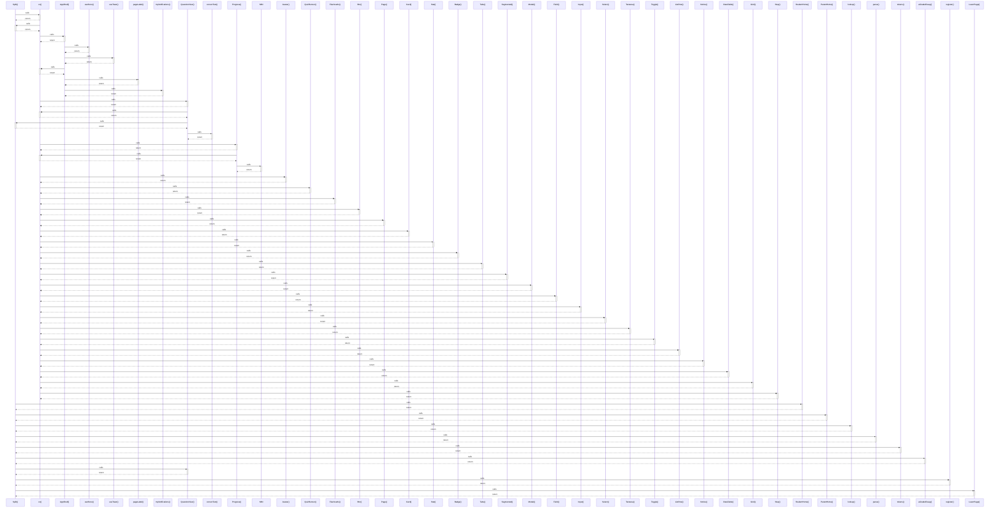

# Split()

> God node · 11 connections · [C:\Users\hp\Desktop\taqat_school\src\ui\Primitives.jsx](file:///C:/Users/hp/Desktop/taqat_school/src/ui/Primitives.jsx#L273)

## Call Trace Diagram

## Connections by Relation

### calls
- [[cx()]] `EXTRACTED`
- [[StudentHome()]] `INFERRED`
- [[ParentHome()]] `INFERRED`
- [[lookup()]] `INFERRED`
- [[parse()]] `INFERRED`
- [[tokens()]] `INFERRED`
- [[aiGradeEssay()]] `INFERRED`
- [[QuestionView()]] `INFERRED`
- [[register()]] `INFERRED`
- [[LearnPage()]] `INFERRED`

### contains
- [[Primitives.jsx]] `EXTRACTED`

---

*Part of the graphify knowledge wiki. See [[index]] to navigate.*