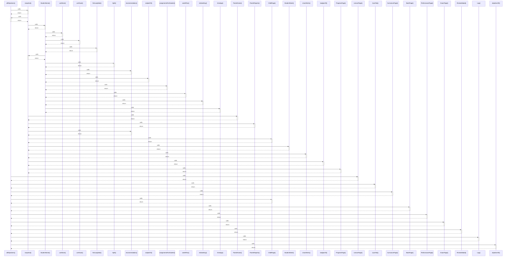

# allObjectives()

> God node · 12 connections · [C:\Users\hp\Desktop\taqat_school\src\store\selectors.js](file:///C:/Users/hp/Desktop/taqat_school/src/store/selectors.js#L10)

## Call Trace Diagram

## Connections by Relation

### calls
- [[snapshot()]] `EXTRACTED`
- [[LessonPage()]] `INFERRED`
- [[QuizTab()]] `INFERRED`
- [[CurriculumPage()]] `INFERRED`
- [[ChildPage()]] `INFERRED`
- [[BankPage()]] `INFERRED`
- [[PerformancePage()]] `INFERRED`
- [[ExamPage()]] `INFERRED`
- [[ReviewModal()]] `INFERRED`
- [[Log()]] `INFERRED`
- [[objectiveOf()]] `EXTRACTED`

### contains
- [[selectors.js]] `EXTRACTED`

---

*Part of the graphify knowledge wiki. See [[index]] to navigate.*