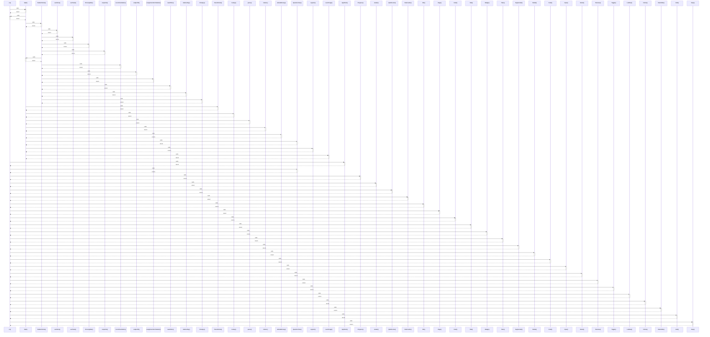

# cx()

> God node · 26 connections · [C:\Users\hp\Desktop\taqat_school\src\ui\Primitives.jsx](file:///C:/Users/hp/Desktop/taqat_school/src/ui/Primitives.jsx#L6)

## Call Trace Diagram

## Connections by Relation

### calls
- [[Split()]] `EXTRACTED`
- [[AppShell()]] `INFERRED`
- [[QuestionView()]] `INFERRED`
- [[Progress()]] `EXTRACTED`
- [[Avatar()]] `EXTRACTED`
- [[QuizRunner()]] `INFERRED`
- [[Flashcards()]] `INFERRED`
- [[Btn()]] `EXTRACTED`
- [[Page()]] `EXTRACTED`
- [[Card()]] `EXTRACTED`
- [[Stat()]] `EXTRACTED`
- [[Badge()]] `EXTRACTED`
- [[Tabs()]] `EXTRACTED`
- [[Segmented()]] `EXTRACTED`
- [[Modal()]] `EXTRACTED`
- [[Field()]] `EXTRACTED`
- [[Input()]] `EXTRACTED`
- [[Select()]] `EXTRACTED`
- [[Textarea()]] `EXTRACTED`
- [[Toggle()]] `EXTRACTED`

### contains
- [[Primitives.jsx]] `EXTRACTED`

---

*Part of the graphify knowledge wiki. See [[index]] to navigate.*