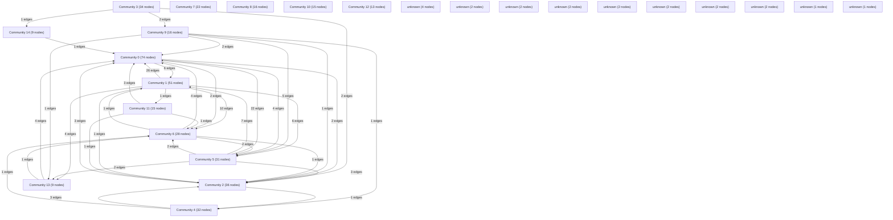

# Knowledge Graph Index

> Auto-generated by graphify. Start here — read community articles for context, then drill into god nodes for detail.

**421 nodes · 712 edges · 25 communities**

---

## System Architecture Flowchart

## Communities
(sorted by size, largest first)

- [[Community 0]] — 74 nodes
- [[Community 1]] — 51 nodes
- [[Community 2]] — 36 nodes
- [[Community 3]] — 34 nodes
- [[Community 4]] — 32 nodes
- [[Community 5]] — 31 nodes
- [[Community 6]] — 28 nodes
- [[Community 7]] — 22 nodes
- [[Community 8]] — 16 nodes
- [[Community 9]] — 16 nodes
- [[Community 10]] — 15 nodes
- [[Community 11]] — 15 nodes
- [[Community 12]] — 13 nodes
- [[Community 13]] — 9 nodes
- [[Community 14]] — 9 nodes
- [[unknown]] — 4 nodes
- [[unknown]] — 2 nodes
- [[unknown]] — 2 nodes
- [[unknown]] — 2 nodes
- [[unknown]] — 2 nodes
- [[unknown]] — 2 nodes
- [[unknown]] — 2 nodes
- [[unknown]] — 2 nodes
- [[unknown]] — 1 nodes
- [[unknown]] — 1 nodes

## God Nodes
(most connected concepts — the load-bearing abstractions)

- [[useStore()]] — 64 connections
- [[useToast()]] — 48 connections
- [[cx()]] — 26 connections
- [[fmtLongDate()]] — 13 connections
- [[StudentHome()]] — 12 connections
- [[allObjectives()]] — 12 connections
- [[reducer()]] — 12 connections
- [[studentOf()]] — 11 connections
- [[snapshot()]] — 11 connections
- [[Split()]] — 11 connections

---

*Generated by [graphify](https://github.com/safishamsi/graphify)*