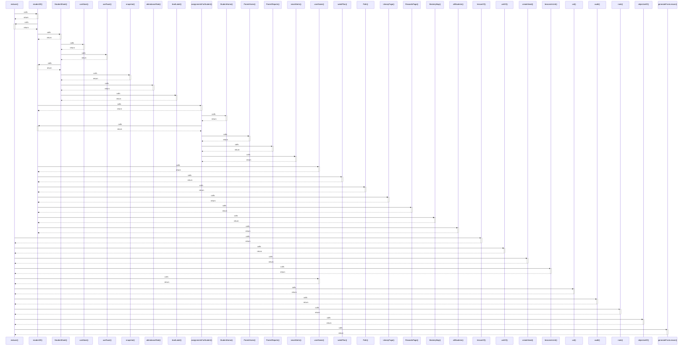

# reducer()

> God node · 12 connections · [C:\Users\hp\Desktop\taqat_school\src\store\StoreProvider.jsx](file:///C:/Users/hp/Desktop/taqat_school/src/store/StoreProvider.jsx#L32)

## Call Trace Diagram

## Connections by Relation

### calls
- [[studentOf()]] `INFERRED`
- [[lessonOf()]] `INFERRED`
- [[unitOf()]] `INFERRED`
- [[createSeed()]] `INFERRED`
- [[lessonsInUnit()]] `INFERRED`
- [[userName()]] `INFERRED`
- [[uid()]] `EXTRACTED`
- [[audit()]] `EXTRACTED`
- [[note()]] `EXTRACTED`
- [[objectiveOf()]] `INFERRED`
- [[generateFromLesson()]] `INFERRED`

### contains
- [[StoreProvider.jsx]] `EXTRACTED`

---

*Part of the graphify knowledge wiki. See [[index]] to navigate.*