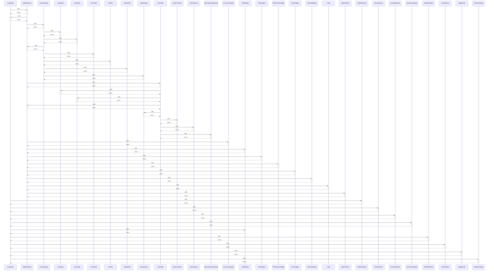

# snapshot()

> God node · 11 connections · [C:\Users\hp\Desktop\taqat_school\src\store\selectors.js](file:///C:/Users/hp/Desktop/taqat_school/src/store/selectors.js#L60)

## Call Trace Diagram

## Connections by Relation

### calls
- [[allObjectives()]] `EXTRACTED`
- [[StudentHome()]] `INFERRED`
- [[ParentHome()]] `INFERRED`
- [[ParentReports()]] `INFERRED`
- [[recommendation()]] `EXTRACTED`
- [[ChildPage()]] `INFERRED`
- [[StudentSheet()]] `INFERRED`
- [[smartAlerts()]] `EXTRACTED`
- [[badgesOf()]] `EXTRACTED`
- [[ProgressPage()]] `INFERRED`

### contains
- [[selectors.js]] `EXTRACTED`

---

*Part of the graphify knowledge wiki. See [[index]] to navigate.*