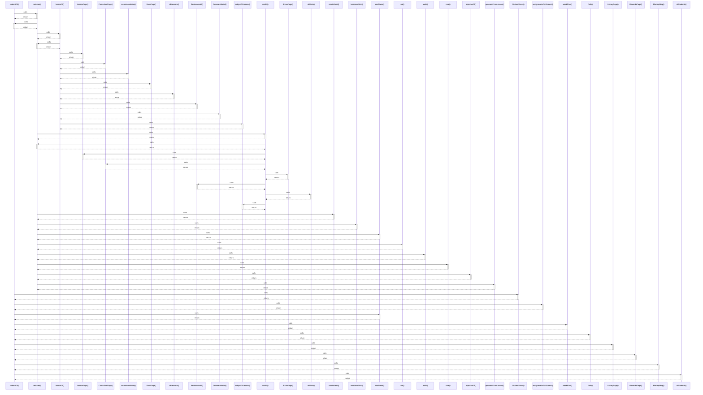

# studentOf()

> God node · 11 connections · [C:\Users\hp\Desktop\taqat_school\src\store\selectors.js](file:///C:/Users/hp/Desktop/taqat_school/src/store/selectors.js#L17)

## Call Trace Diagram

## Connections by Relation

### calls
- [[reducer()]] `INFERRED`
- [[StudentSheet()]] `INFERRED`
- [[assignmentsForStudent()]] `EXTRACTED`
- [[userName()]] `EXTRACTED`
- [[weekPlan()]] `EXTRACTED`
- [[Path()]] `INFERRED`
- [[LibraryPage()]] `INFERRED`
- [[RewardsPage()]] `INFERRED`
- [[MasteryMap()]] `INFERRED`
- [[allStudents()]] `EXTRACTED`

### contains
- [[selectors.js]] `EXTRACTED`

---

*Part of the graphify knowledge wiki. See [[index]] to navigate.*