# useToast()

> God node · 48 connections · [C:\Users\hp\Desktop\taqat_school\src\ui\Brand.jsx](file:///C:/Users/hp/Desktop/taqat_school/src/ui/Brand.jsx#L47)

## Call Trace Diagram

```mermaid
sequenceDiagram
    participant P0 as useToast()
    participant P1 as StudentHome()
    participant P2 as useStore()
    participant P3 as ParentHome()
    participant P4 as ParentReports()
    participant P5 as Messages()
    participant P6 as LessonPage()
    participant P7 as QuizTab()
    participant P8 as CurriculumPage()
    participant P9 as ChildPage()
    participant P10 as useChild()
    participant P11 as BankPage()
    participant P12 as StudentSheet()
    participant P13 as PerformancePage()
    participant P14 as ExamPage()
    participant P15 as AttendancePage()
    participant P16 as TeacherHome()
    participant P17 as ReviewModal()
    participant P18 as GenerateModal()
    participant P19 as AppShell()
    participant P20 as ParentAttendance()
    participant P21 as PrivacyPage()
    participant P22 as SchoolAttendance()
    participant P23 as SchoolHome()
    participant P24 as LicensesPage()
    participant P25 as Path()
    participant P26 as LibraryPage()
    participant P27 as RewardsPage()
    participant P28 as Routed()
    participant P29 as SchoolReports()
    participant P30 as SummaryTab()
    participant P31 as Overview()
    participant P32 as Log()
    participant P33 as SupervisorHome()
    participant P34 as ReviewForm()
    participant P35 as SupervisorReports()
    participant P36 as AiPage()
    participant P37 as BillingPage()
    participant P38 as SystemHome()
    participant P39 as AssignmentsPage()
    participant P40 as ClassesPage()
    participant P41 as GradingPage()
    participant P42 as ReviewPage()
    participant P43 as BlueprintModal()
    participant P44 as StructurePage()
    participant P45 as UsersPage()
    participant P46 as AddUser()
    participant P47 as AskTab()
    participant P48 as Flashcards()
    participant P49 as ProgressPage()
    participant P50 as MasteryMap()
    participant P51 as Plan()
    participant P52 as KpisPage()
    participant P53 as AuditPage()
    participant P54 as IntegrationsPage()
    participant P55 as RbacPage()
    participant P56 as TenantsPage()
    participant P57 as NewTenant()
    participant P58 as GradeCell()
    participant P59 as NewAssignment()
    participant P60 as AddStudent()
    participant P61 as NewClass()
    participant P62 as SettingsDialog()
    participant P63 as QualityPage()
    participant P64 as SecurityPage()
    participant P65 as fmtLongDate()
    participant P66 as snapshot()
    participant P67 as Split()
    participant P68 as recommendation()
    participant P69 as subjectOf()
    participant P70 as assignmentsForStudent()
    participant P71 as weekPlan()
    participant P72 as relativeDay()
    participant P73 as timeAgo()
    participant P74 as ExplainTab()
    P0->>+ P1: calls
    P1-->>- P0: return
    P1->>+ P2: calls
    P2-->>- P1: return
    P2->>+ P1: calls
    P1-->>- P2: return
    P2->>+ P3: calls
    P3-->>- P2: return
    P2->>+ P4: calls
    P4-->>- P2: return
    P2->>+ P5: calls
    P5-->>- P2: return
    P2->>+ P6: calls
    P6-->>- P2: return
    P2->>+ P7: calls
    P7-->>- P2: return
    P2->>+ P8: calls
    P8-->>- P2: return
    P2->>+ P9: calls
    P9-->>- P2: return
    P2->>+ P10: calls
    P10-->>- P2: return
    P2->>+ P11: calls
    P11-->>- P2: return
    P2->>+ P12: calls
    P12-->>- P2: return
    P2->>+ P13: calls
    P13-->>- P2: return
    P2->>+ P14: calls
    P14-->>- P2: return
    P2->>+ P15: calls
    P15-->>- P2: return
    P2->>+ P16: calls
    P16-->>- P2: return
    P2->>+ P17: calls
    P17-->>- P2: return
    P2->>+ P18: calls
    P18-->>- P2: return
    P2->>+ P19: calls
    P19-->>- P2: return
    P2->>+ P20: calls
    P20-->>- P2: return
    P2->>+ P21: calls
    P21-->>- P2: return
    P2->>+ P22: calls
    P22-->>- P2: return
    P2->>+ P23: calls
    P23-->>- P2: return
    P2->>+ P24: calls
    P24-->>- P2: return
    P2->>+ P25: calls
    P25-->>- P2: return
    P2->>+ P26: calls
    P26-->>- P2: return
    P2->>+ P27: calls
    P27-->>- P2: return
    P2->>+ P28: calls
    P28-->>- P2: return
    P2->>+ P29: calls
    P29-->>- P2: return
    P2->>+ P30: calls
    P30-->>- P2: return
    P2->>+ P31: calls
    P31-->>- P2: return
    P2->>+ P32: calls
    P32-->>- P2: return
    P2->>+ P33: calls
    P33-->>- P2: return
    P2->>+ P34: calls
    P34-->>- P2: return
    P2->>+ P35: calls
    P35-->>- P2: return
    P2->>+ P36: calls
    P36-->>- P2: return
    P2->>+ P37: calls
    P37-->>- P2: return
    P2->>+ P38: calls
    P38-->>- P2: return
    P2->>+ P39: calls
    P39-->>- P2: return
    P2->>+ P40: calls
    P40-->>- P2: return
    P2->>+ P41: calls
    P41-->>- P2: return
    P2->>+ P42: calls
    P42-->>- P2: return
    P2->>+ P43: calls
    P43-->>- P2: return
    P2->>+ P44: calls
    P44-->>- P2: return
    P2->>+ P45: calls
    P45-->>- P2: return
    P2->>+ P46: calls
    P46-->>- P2: return
    P2->>+ P47: calls
    P47-->>- P2: return
    P2->>+ P48: calls
    P48-->>- P2: return
    P2->>+ P49: calls
    P49-->>- P2: return
    P2->>+ P50: calls
    P50-->>- P2: return
    P2->>+ P51: calls
    P51-->>- P2: return
    P2->>+ P52: calls
    P52-->>- P2: return
    P2->>+ P53: calls
    P53-->>- P2: return
    P2->>+ P54: calls
    P54-->>- P2: return
    P2->>+ P55: calls
    P55-->>- P2: return
    P2->>+ P56: calls
    P56-->>- P2: return
    P2->>+ P57: calls
    P57-->>- P2: return
    P2->>+ P58: calls
    P58-->>- P2: return
    P2->>+ P59: calls
    P59-->>- P2: return
    P2->>+ P60: calls
    P60-->>- P2: return
    P2->>+ P61: calls
    P61-->>- P2: return
    P2->>+ P62: calls
    P62-->>- P2: return
    P2->>+ P63: calls
    P63-->>- P2: return
    P2->>+ P64: calls
    P64-->>- P2: return
    P1->>+ P0: calls
    P0-->>- P1: return
    P1->>+ P65: calls
    P65-->>- P1: return
    P1->>+ P66: calls
    P66-->>- P1: return
    P1->>+ P67: calls
    P67-->>- P1: return
    P1->>+ P68: calls
    P68-->>- P1: return
    P1->>+ P69: calls
    P69-->>- P1: return
    P1->>+ P70: calls
    P70-->>- P1: return
    P1->>+ P71: calls
    P71-->>- P1: return
    P1->>+ P72: calls
    P72-->>- P1: return
    P1->>+ P73: calls
    P73-->>- P1: return
    P0->>+ P4: calls
    P4-->>- P0: return
    P0->>+ P5: calls
    P5-->>- P0: return
    P0->>+ P6: calls
    P6-->>- P0: return
    P0->>+ P7: calls
    P7-->>- P0: return
    P0->>+ P8: calls
    P8-->>- P0: return
    P0->>+ P11: calls
    P11-->>- P0: return
    P0->>+ P12: calls
    P12-->>- P0: return
    P0->>+ P13: calls
    P13-->>- P0: return
    P0->>+ P14: calls
    P14-->>- P0: return
    P0->>+ P15: calls
    P15-->>- P0: return
    P0->>+ P17: calls
    P17-->>- P0: return
    P0->>+ P18: calls
    P18-->>- P0: return
    P0->>+ P19: calls
    P19-->>- P0: return
    P0->>+ P20: calls
    P20-->>- P0: return
    P0->>+ P21: calls
    P21-->>- P0: return
    P0->>+ P22: calls
    P22-->>- P0: return
    P0->>+ P24: calls
    P24-->>- P0: return
    P0->>+ P26: calls
    P26-->>- P0: return
    P0->>+ P29: calls
    P29-->>- P0: return
    P0->>+ P30: calls
    P30-->>- P0: return
    P0->>+ P34: calls
    P34-->>- P0: return
    P0->>+ P35: calls
    P35-->>- P0: return
    P0->>+ P36: calls
    P36-->>- P0: return
    P0->>+ P37: calls
    P37-->>- P0: return
    P0->>+ P39: calls
    P39-->>- P0: return
    P0->>+ P40: calls
    P40-->>- P0: return
    P0->>+ P41: calls
    P41-->>- P0: return
    P0->>+ P42: calls
    P42-->>- P0: return
    P0->>+ P43: calls
    P43-->>- P0: return
    P0->>+ P44: calls
    P44-->>- P0: return
    P0->>+ P45: calls
    P45-->>- P0: return
    P0->>+ P46: calls
    P46-->>- P0: return
    P0->>+ P47: calls
    P47-->>- P0: return
    P0->>+ P51: calls
    P51-->>- P0: return
    P0->>+ P52: calls
    P52-->>- P0: return
    P0->>+ P53: calls
    P53-->>- P0: return
    P0->>+ P54: calls
    P54-->>- P0: return
    P0->>+ P55: calls
    P55-->>- P0: return
    P0->>+ P56: calls
    P56-->>- P0: return
    P0->>+ P57: calls
    P57-->>- P0: return
    P0->>+ P58: calls
    P58-->>- P0: return
    P0->>+ P59: calls
    P59-->>- P0: return
    P0->>+ P60: calls
    P60-->>- P0: return
    P0->>+ P61: calls
    P61-->>- P0: return
    P0->>+ P62: calls
    P62-->>- P0: return
    P0->>+ P74: calls
    P74-->>- P0: return
```

## Connections by Relation

### calls
- [[StudentHome()]] `INFERRED`
- [[ParentReports()]] `INFERRED`
- [[Messages()]] `INFERRED`
- [[LessonPage()]] `INFERRED`
- [[QuizTab()]] `INFERRED`
- [[CurriculumPage()]] `INFERRED`
- [[BankPage()]] `INFERRED`
- [[StudentSheet()]] `INFERRED`
- [[PerformancePage()]] `INFERRED`
- [[ExamPage()]] `INFERRED`
- [[AttendancePage()]] `INFERRED`
- [[ReviewModal()]] `INFERRED`
- [[GenerateModal()]] `INFERRED`
- [[AppShell()]] `INFERRED`
- [[ParentAttendance()]] `INFERRED`
- [[PrivacyPage()]] `INFERRED`
- [[SchoolAttendance()]] `INFERRED`
- [[LicensesPage()]] `INFERRED`
- [[LibraryPage()]] `INFERRED`
- [[SchoolReports()]] `INFERRED`

### contains
- [[Brand.jsx]] `EXTRACTED`

---

*Part of the graphify knowledge wiki. See [[index]] to navigate.*